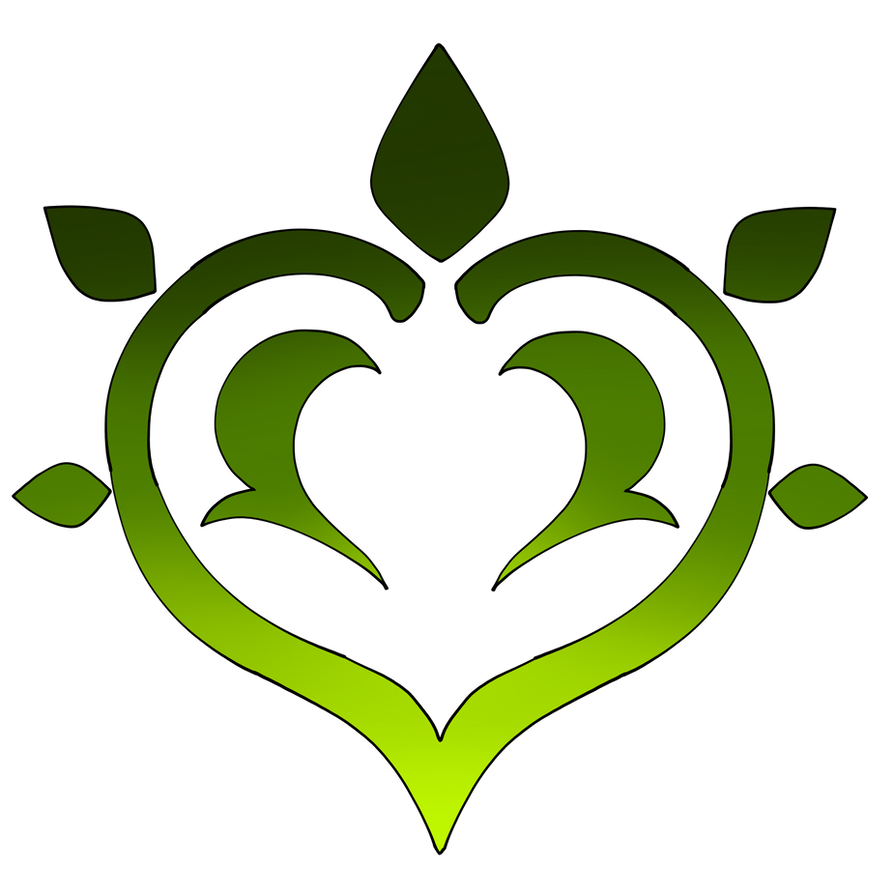

<h1 align="center"> Сайн уу!, I'm c1truus</h1>

Wannabe AI/ML & Full-Stack Developer with a passion for Embedded Systems and Robotics

[![][social-youtube-shield]][social-youtube-link]
[![][social-linkedin-shield]][social-linkedin-link]
[![][social-email-shield]][social-email-link]

  

---
<!--![][banner]-->

## 🤓 About Me
I'm a Senior Year Undergrad in **Beijing Institute of Technology** `I like to call it bit :3` , My major is **Artificial Intelligence**.

I'm a versatile developer, I like **AI/ML**, **Embedded Systems**, **Full-Stack Development**, **Robotics and 3D CAD Desinging and Printing**.

My curiosity drives me to explore the intersections of hardware and software, from designing neural networks to programming microcontrollers. 

I thrive on solving complex problems and building systems that make a real-world impact.
But truthfully I just like see the project that I wanted become a reality and be amazed that it works.

- 🌟 Passionate about **AI**, **Robotics**, **Computer Vision**, and **IoT & Embedded Systems**.
- 🔍 Always learning and experimenting with new tools, frameworks and electrical zip zaps.
- 🤝 Open to collaboration on exciting projects let's create something extraordinary! 

---

## 💻 Tech Stack & Tools

### 🔧 Core Development
| Domain           | Technologies                                                                 |
|------------------|------------------------------------------------------------------------------|
| **Embedded**     | ![][embedded-c] ![][embedded-cpp] ![][embedded-arduino] ![][embedded-stm32] ![][embedded-esp32] |
| **AI/ML**        | ![][ml-pytorch] ![][ml-tensorflow] ![][ml-keras] ![][ml-scikit] ![][ml-cuda] ![][ml-jupyter] |
| **Backend**      | ![][backend-python] ![][backend-cmake] ![][backend-ros2] ![][backend-nodejs] |

### 🎨 Dev Tools
| Domain           | Technologies                                                                 |
|------------------|------------------------------------------------------------------------------|
| **CAD/EDA**      | ![][design-onshape] ![][design-kicad] ![][design-bambu] |
| **Media**        | ![][design-gimp] ![][design-kdenlive] ![][design-reaper] |
| **IDE/Editors**  | ![][ide-neovim] ![][ide-vscode] ![][ide-qt] ![][ide-stm32cube] |

### ⚙️ Systems & DevOps
| Domain           | Technologies                                                                 |
|------------------|------------------------------------------------------------------------------|
| **OS/Platforms** | ![][os-ubuntu] ![][os-raspberrypi] |
| **Tools**        | ![][tools-markdown] ![][tools-latex] ![][tools-libreoffice] ![][tools-shell] ![][tools-git] |

---

## 🚀 Featured Projects

### 🤖 Embedded Systems & FPGA
- **[Morphological Filter FPGA](https://github.com/c1truus/morphological-filter-fpga)**  
  Hardware-accelerated image processing implementation on FPGA.

### 🧠 AI/ML & Computer Vision
- **[Crop vs Weed Classifier](https://github.com/c1truus/crop-vs-weed-classified-using-CNN)**  
  CNN-based agricultural classification system for precision farming.
- **[Hand-Drawn Doodle Classifier](https://github.com/c1truus/Hand-Drawn-Doodle-Classsifier)**  
  Neural network for recognizing and classifying hand-drawn sketches.
- **[XGBoost Classification](https://github.com/c1truus/aaa)**  
  Higgs Boson event classification using XGBoost for high-energy physics.

### 🌐 Full-Stack Applications
- **[DCMS](https://github.com/c1truus/DCMS)**  
  Full-stack Dental Clinic Management System built with Qt Creator.
- **[DCMS Server](https://github.com/c1truus/DCMS-server)**  
  Robust backend API and database management system.
- **[International Bookstore Database](https://github.com/c1truus/International-Bookstore)**  
  Multi-language bookstore database design using MySQL.
- **[SHMS](https://github.com/c1truus/SHMS)**  
  Comprehensive Student Housing Management System.

### 🔄 Ongoing & Future Development
- **Embedded Robotics**: Developing ROS2-based systems with sensor integration.
- **IoT Sensor Networks**: Building real-time environmental monitoring solutions.
- **ML Model Optimization**: Enhancing performance for edge device deployment.

---

## 📊 GitHub Stats

  
  

  

---

## 🏅 Achievements

  

---

## 🖇️ Let's Connect

> [!NOTE]
> I'm always excited to collaborate on innovative projects or discuss new ideas! Feel free to reach out.

  <strong>Let's build something extraordinary together! :3 </strong>

<!--

  

 -->

<!-- SHIELD GROUP -->
[banner]: ./README.assets/TheDestroyerOfTheWorld.jpg

<!-- Social Links -->
[social-youtube-shield]: https://img.shields.io/badge/-YouTube-black?labelColor=black&logo=youtube&logoColor=white&style=flat-square
[social-youtube-link]: https://www.youtube.com/@Koni-Co
[social-linkedin-shield]: https://img.shields.io/badge/-LinkedIn-black?labelColor=black&logo=linkedin&logoColor=white&style=flat-square
[social-linkedin-link]: https://www.linkedin.com/in/c1truus/
[social-email-shield]: https://img.shields.io/badge/-Email-black?labelColor=black&logo=gmail&logoColor=white&style=flat-square
[social-email-link]: mailto:g.turuu1128@gmail.com

<!-- Embedded Technologies -->
[embedded-c]: https://img.shields.io/badge/-C-000?style=flat-square&logoColor=white&logo=c
[embedded-cpp]: https://img.shields.io/badge/-C%2B%2B-000?style=flat-square&logoColor=white&logo=cplusplus
[embedded-arduino]: https://img.shields.io/badge/-Arduino-000?style=flat-square&logoColor=white&logo=arduino
[embedded-stm32]: https://img.shields.io/badge/-STM32-000?style=flat-square&logoColor=white&logo=stmicroelectronics
[embedded-esp32]: https://img.shields.io/badge/-ESP32-000?style=flat-square&logoColor=white&logo=espressif

<!-- AI/ML Technologies -->
[ml-pytorch]: https://img.shields.io/badge/-PyTorch-000?style=flat-square&logoColor=white&logo=pytorch
[ml-tensorflow]: https://img.shields.io/badge/-TensorFlow-000?style=flat-square&logoColor=white&logo=tensorflow
[ml-keras]: https://img.shields.io/badge/-Keras-000?style=flat-square&logoColor=white&logo=keras
[ml-scikit]: https://img.shields.io/badge/-Scikit_Learn-000?style=flat-square&logoColor=white&logo=scikitlearn
[ml-cuda]: https://img.shields.io/badge/-CUDA-000?style=flat-square&logoColor=white&logo=nvidia
[ml-jupyter]: https://img.shields.io/badge/-Jupyter-000?style=flat-square&logoColor=white&logo=jupyter

<!-- Backend Technologies -->
[backend-python]: https://img.shields.io/badge/-Python-000?style=flat-square&logoColor=white&logo=python
[backend-cmake]: https://img.shields.io/badge/-CMake-000?style=flat-square&logoColor=white&logo=cmake
[backend-ros2]: https://img.shields.io/badge/-ROS2-000?style=flat-square&logoColor=white&logo=ros
[backend-nodejs]: https://img.shields.io/badge/-Node.js-000?style=flat-square&logoColor=white&logo=nodedotjs

<!-- Frontend Technologies -->
[frontend-js]: https://img.shields.io/badge/-JavaScript-000?style=flat-square&logoColor=white&logo=javascript
[frontend-css]: https://img.shields.io/badge/-CSS3-000?style=flat-square&logoColor=white&logo=css3
[frontend-react]: https://img.shields.io/badge/-React-000?style=flat-square&logoColor=white&logo=react

<!-- Design & CAD Tools -->
[design-onshape]: https://img.shields.io/badge/-OnShape-000?style=flat-square&logoColor=white&logo=onshape
[design-kicad]: https://img.shields.io/badge/-KiCAD-000?style=flat-square&logoColor=white&logo=kicad
[design-bambu]: https://img.shields.io/badge/-Bambu_Studio-000?style=flat-square&logoColor=white&logo=bambulab
[design-vivado]: https://img.shields.io/badge/-Vivado-000?style=flat-square&logoColor=white&logo=xilinx
[design-verilog]: https://img.shields.io/badge/-Verilog-000?style=flat-square&logoColor=white&logo=verilog
[design-gimp]: https://img.shields.io/badge/-GIMP-000?style=flat-square&logoColor=white&logo=gimp
[design-kdenlive]: https://img.shields.io/badge/-Kdenlive-000?style=flat-square&logoColor=white&logo=kdenlive
[design-reaper]: https://img.shields.io/badge/-Reaper-000?style=flat-square&logoColor=white&logo=cockos

<!-- IDE & Editors -->
[ide-neovim]: https://img.shields.io/badge/-NeoVim-000?style=flat-square&logoColor=white&logo=neovim
[ide-vscode]: https://img.shields.io/badge/-VS_Code-000?style=flat-square&logoColor=white&logo=visualstudiocode
[ide-qt]: https://img.shields.io/badge/-Qt_Creator-000?style=flat-square&logoColor=white&logo=qt
[ide-stm32cube]: https://img.shields.io/badge/-STM32Cube-000?style=flat-square&logoColor=white&logo=stmicroelectronics

<!-- OS & Platforms -->
[os-ubuntu]: https://img.shields.io/badge/-Ubuntu-000?style=flat-square&logoColor=white&logo=ubuntu
[os-raspberrypi]: https://img.shields.io/badge/-Raspberry_Pi-000?style=flat-square&logoColor=white&logo=raspberrypi
[os-windows]: https://img.shields.io/badge/-Windows-000?style=flat-square&logoColor=white&logo=windows

<!-- Tools -->
[tools-markdown]: https://img.shields.io/badge/-Markdown-000?style=flat-square&logoColor=white&logo=markdown
[tools-latex]: https://img.shields.io/badge/-LaTeX-000?style=flat-square&logoColor=white&logo=latex
[tools-libreoffice]: https://img.shields.io/badge/-LibreOffice-000?style=flat-square&logoColor=white&logo=libreoffice
[tools-ssh]: https://img.shields.io/badge/-SSH-000?style=flat-square&logoColor=white&logo=ssh
[tools-shell]: https://img.shields.io/badge/-Shell_Script-000?style=flat-square&logoColor=white&logo=gnubash
[tools-git]: https://img.shields.io/badge/-Git-000?style=flat-square&logoColor=white&logo=git
[tools-docker]: https://img.shields.io/badge/-Docker-000?style=flat-square&logoColor=white&logo=docker
